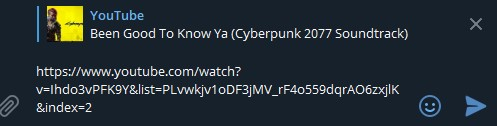

# This Telegram bot send an audio file of Youtube Video

[](https://twitter.com/bob_volskiy)

# Installation: 
  - Download Python 3+
  - In the terminal enter the command `pip install pyTelegramBotAPI`
  - Create bot here https://t.me/BotFather and copy it's Token
  - Download latest release and create `config.py` in folder with `bot.py`. `config.py` example down below
  - Run `bot.py`. If ok, it will print `Бот начал свою работу...`

# User guide: 
  - Send a link of youtube video. youtu.be or youtube.com - doesnt matter
  - Wait just a little and bot will send you .mp3 file.

# Working example: 



# config.py example
```
owner = xxxxxxxxx # int var of your telegram id
token = "TOKEN" # Bot token https://t.me/BotFather
```